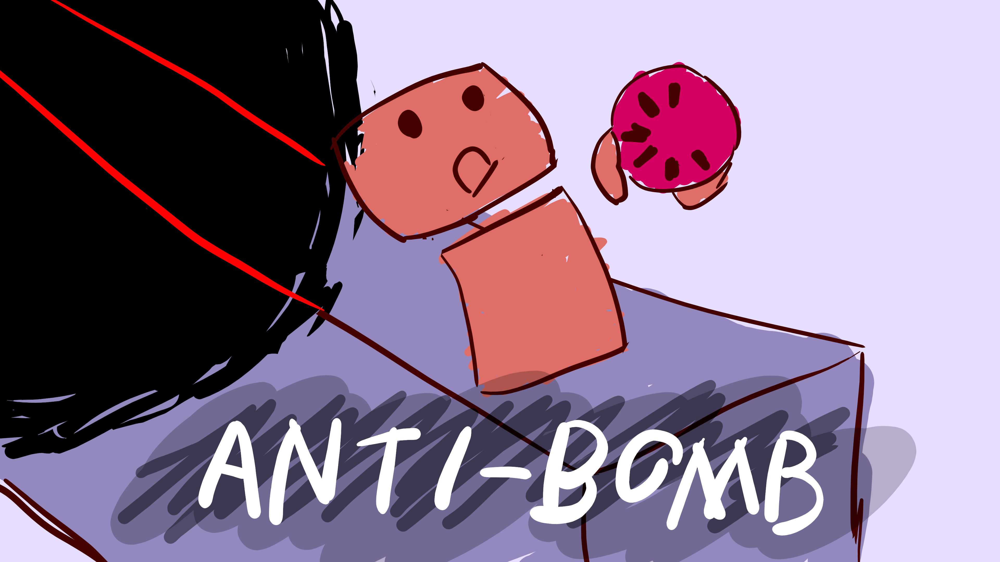

# Anti-Bomb

# Description
Anti-Bomb is a puzzle platformer where you use your anti-matter bombs to make your way through the level.

This is [a submission](https://ldjam.com/events/ludum-dare/48/inside-the-box) to the Ludum Dare 49 game jam  
Also check out the [itch.io game page](https://icylavah.itch.io/antibomb)

# Controls & Instructions
* **F11** or **Alt+Enter** to toggle fullscreen mode
* **WASD** or **Arrow keys** to move and jump
* You can also use **Space** to jump
* Use the **mouse cursor** to direct the bomb
* Press and hold the **left mouse button** to arm the bomb, **release it** to throw it
* Use the explosion of the bomb to traverse the level!
* **Tip:** try to time your jump with the explosion of the bomb - you get more upwards momentum that way

# Tools used

* **Love2D** - Game Framework
* **VS Code** - Code editing
* **Tiled** - Level editing
* **Ableton Live** - Music & Sound Effects
* **Krita** - Title Screen / Cover art
* **GNU Make** - Build system
* **Milton** - Concept art & task tracking
* **Git & GitHub** - Source control & Source hosting
* **itch.io** - Game hosting

# Running and Building
Normaly you can just use the `love` executable with the source folder as a parameter to run the game. However the game needs map files which need to be converted from the native Tiled format to json format. You can do this manually using Tiled in which case you can run the game exactly like mentioned: change to the root of the source directory and run `love .`

Alternatively, you can use the GNU Make build system. The requirements for this are listed below.

## Requirements
* Linux or Windows Subsystem for Linux (WSL)
* [Love2D](https://love2d.org/) executable in your system path
* [Tiled Editor](https://www.mapeditor.org/) for map exporting
	* `tiled` executable must be in your system path
	* For WSL it can be a native Windows executable
	* For WSL it can be in the default Windows installation directory: `C:\Program Files\Tiled\tiled.exe`
* `make`, `curl` and `7z`
	* Debian/Ubuntu based install: `sudo apt install make curl p7zip-full -y`
* Building .AppImage executables:
	* WSL requires WSL2
	* The building machine is assumed to be of x86-64 architecture

## Make
The make system can build 64 and 32 bit Windows executables and Linux AppImages. It downloads the required Love2D binaries automatically. It also downloads `appimagetool` for building AppImages.
* `make all` - build all executables
* `make build_win64` - build windows 64-bit zip
* `make build_lin64` - build linux 64-bit .AppImage
* `make clean` - delete build directory and exported map files
* `make run` - export updated Tiled maps and execute the `run` script (or `run.cmd` on WSL)
* `make build_maps` - export updated Tiled maps